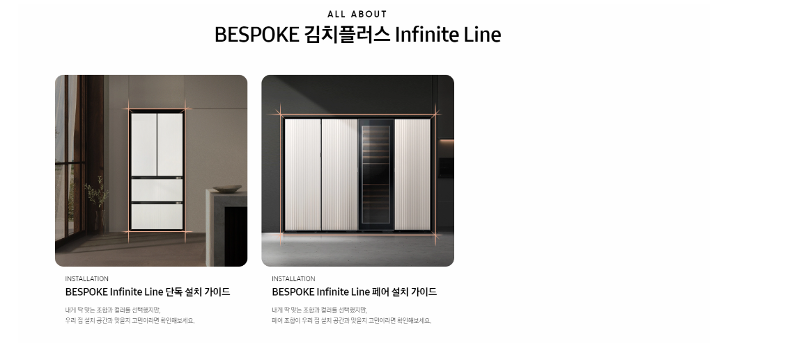
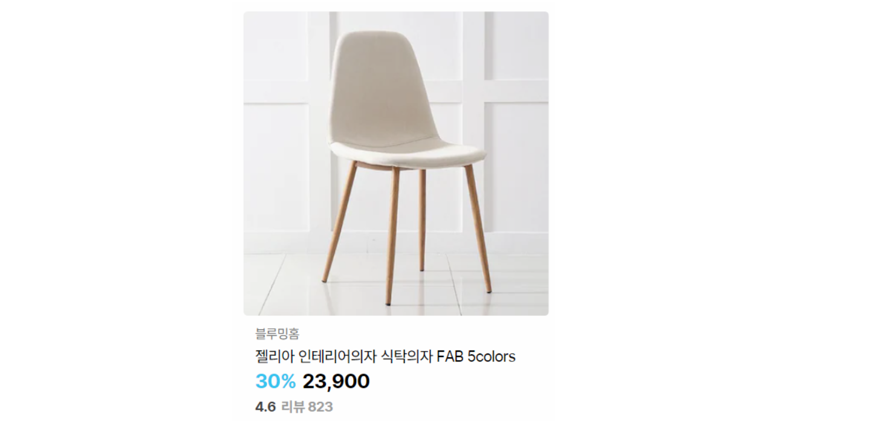

## 🚀 0830 HTML/CSS 실습 

###  실습 1

### 상단 문구

* 상단 문구는 `h2` 태그를 활용하여 작성합니다.

* ALL ABOUT의 글씨 크기만 12px로 변경하고 줄바꿈을 합니다.

### 카드

* 카드들의 전체 영역의 너비는 900px입니다.

* 개별 카드 아이템(이미지 및 텍스트)의 너비는 300px입니다.

* 이미지는 `images` 폴더를 활용합니다. 

---

### 실습 2

> 아래의 내용을 참고하여 만들어봅시다. 색상, 크기 및 문구는 변경 가능합니다.

### 카드 

* 카드의 너비는 300px입니다.

* 상품명은 `h3` 태그를 활용하며 나머지 모든 글씨는 자유롭게 활용합니다.

---

### 🚀 0830 HTML/CSS 실습 _ 총평

> 많이 공부해왔던 HTML/CSS이 막상 실습을 통해 어색하게 느껴졌습니다. 많은 연습이 필요하다고 생각했고, 특히 CSS 의 선택자 설정에 대해서 더 공부가 필요하다고 느껴졌습니다. 